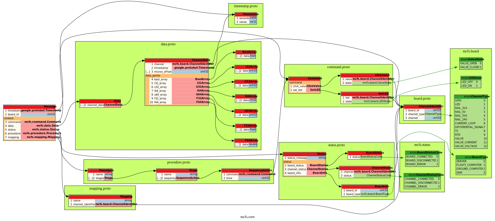
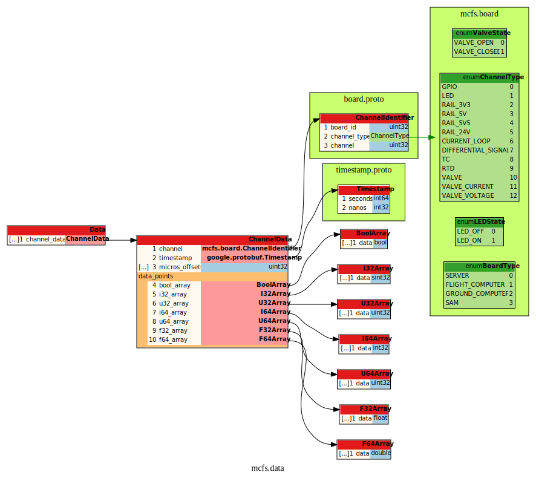
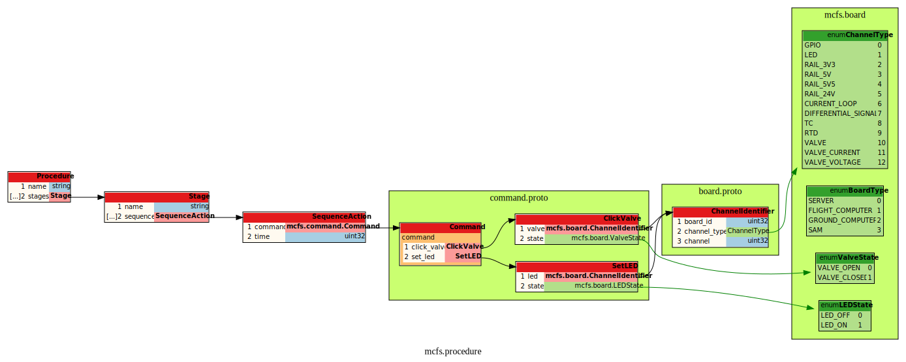
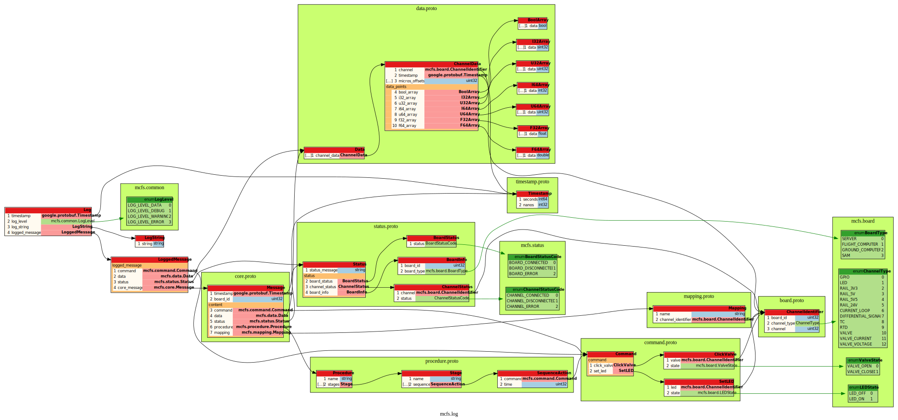
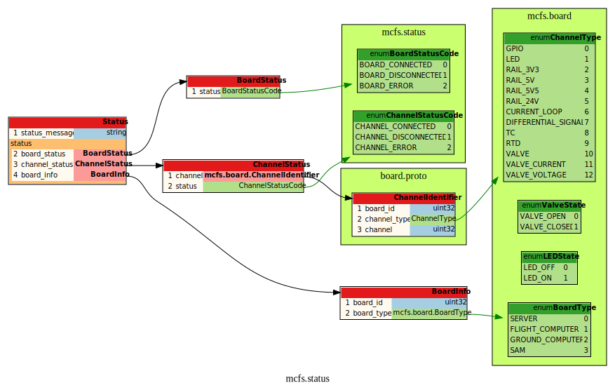
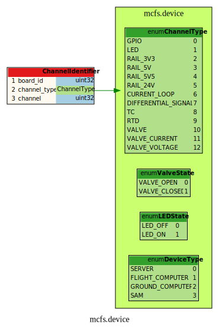
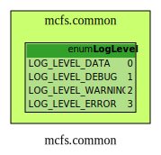

# fs-protobuf

Protocol buffer definition for fullscale mcfs

| File            | Description |
|-----------------|-------------|
| core.proto      | Top level message to be used in generalized mcfs code |
| data.proto      | All high-frequency communication and sensor data      |
| command.proto   | MCFS commands                                         |
| log.proto       | Definitions for local data and debug logging          |
| status.proto    | System status                                         |
| device.proto    | Descriptors for devices, channels, and nodes          |
| common.proto    | Shared enums                                          |

## Diagrams

### Core

### Data

### Command

### Procedure

### Log

### Status

### Device

### Common

